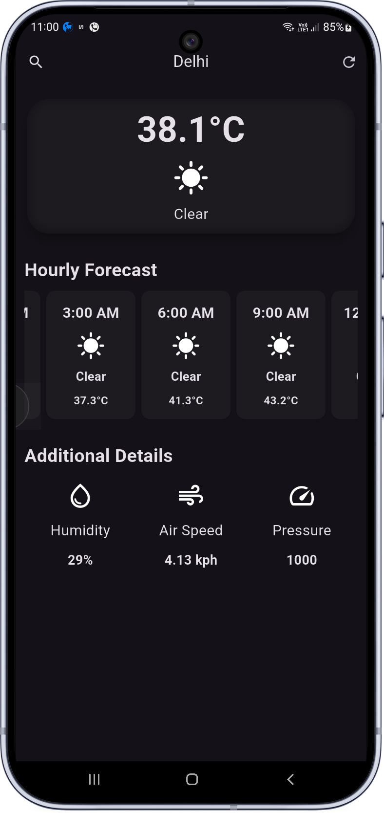

# 🌤️ Weather App - Real-time Forecast


A modern, high-performance weather application built with Flutter that provides real-time weather updates and 5-day forecasts. This project focuses on **Glassmorphism design**, **efficient state management**, and **asynchronous data handling**.

## App Preview


## 🚀 Key Features

- **Real-time Weather Data**: Instant updates for temperature, conditions, humidity, wind speed, and pressure.
- **Dynamic City Search**: Search weather for any city globally with an interactive search dialog.
- **5-Day / 3-Hour Forecast**: Scrollable horizontal list showing weather predictions using dynamic API data.
- **Glassmorphism UI**: Premium "Frosted Glass" effect implemented using `BackdropFilter`.
- **Adaptive UX**: Platform-aware loading indicators and responsive layouts for all screen sizes.
- **Pull-to-Refresh**: Seamless data synchronization with a single tap.

## 🛠️ Technical Implementation & Skills

### 1. Asynchronous Programming & API Integration
- **`FutureBuilder`**: Managed the UI lifecycle by handling `ConnectionState.waiting`, `snapshot.hasError`, and data rendering.
- **HTTP Networking**: Robust API communication using the `http` package with `async/await`.
- **Data Persistence in State**: Optimized performance by storing the `Future` in a `late` variable during `initState` to prevent redundant network calls on widget rebuilds.

### 2. State & Lifecycle Management
- **`StatefulWidget`**: Used to handle dynamic state changes like city updates and refresh cycles.
- **Widget Lifecycle**: Proper use of `initState` for initialization and `dispose` for cleaning up `TextEditingController`.

### 3. UI Optimization & Design Patterns
- **ListView.builder**: Implemented for memory-efficient rendering of the forecast carousel, only building items visible on the screen.
- **Modular Architecture**: Separated concerns by creating reusable components like `AdditionalInfo` and `HourlyForecastItem`.
- **`intl` Integration**: Used for professional date and time formatting (12-hour AM/PM conversion).

### 4. UI Techniques
- **Blur & Clipping**: Utilized `ClipRRect` and `BackdropFilter` to achieve a modern aesthetic.
- **Responsive Design**: Used `MediaQuery` to ensure the layout adapts to various screen dimensions.

## 📦 Core Widgets & Properties Used

- **`BackdropFilter` & `ImageFilter`**: Core of the Glassmorphism effect.
- **`SingleChildScrollView`**: Ensures scrollability on smaller devices to prevent overflow.
- **`TextEditingController`**: Managed user input for the search functionality.
- **`CircularProgressIndicator.adaptive`**: Native loading experience for both iOS and Android.

## ⚙️ How to Run Locally

1. **Clone the repository**
   ```bash
   git clone https://github.com/Varun-dev10/Weather_APP.git
   ```
2. **Setup API Key**
   - Get your free API key from [OpenWeatherMap](https://openweathermap.org/api).
   - Create a file `lib/secrets.dart`.
   - Add: `const openWeatherAPIKEY = 'YOUR_API_KEY_HERE';`
3. **Install Dependencies**
   ```bash
   flutter pub get
   ```
4. **Run Application**
   ```bash
   flutter run
   ```

---

## 📱 Try the App

You can download and install the latest version of the app directly from the link below:

> [!TIP]
> **[Download Weather App APK](Assets/apk/app-release.apk)**
> *(Note: You may need to enable "Install from Unknown Sources" on your Android device)*


-----


